> **⚠ This is an audited fork.** Read [`AUDIT.md`](AUDIT.md) first — it documents the file-level audit, renderer lock-in analysis, count discrepancies, and the three substantive changes this fork makes to [upstream `markdown-viewer/skills`](https://github.com/markdown-viewer/skills) (added `LICENSE`, added `AUDIT.md`, stripped promotional metadata from 15 `SKILL.md` files).
>
> The upstream README is preserved below unchanged for traceability.

---

# Markdown Viewer Agent Skills

Opinionated skills for AI coding agents to create stunning diagrams and visualizations directly in Markdown. These skills extend agent capabilities across diagram generation, data visualization, and technical documentation.

**14 skills** covering 5 rendering engines — from software modeling to enterprise architecture, data analytics, and editorial-quality content cards.

Skills follow the [Agent Skills](https://agentskills.io/) format.

---

## 🧭 Quick Navigation

**[🚀 Installation](#-installation)** • **[📚 Available Skills](#-available-skills)** • **[📖 Skill Structure](#-skill-structure)** • **[🔗 Links](#-links)**

---

## 🚀 Installation

### Quick Install (Recommended)

```bash
npx skills add markdown-viewer/skills
```

This method works with multiple AI coding agents (Claude Code, Codex, Cursor, etc.)

### Manual Installation

**For Claude Code (Manual)**
```bash
cp -r skills/<skill-name> ~/.claude/skills/
```

**For claude.ai**

Add skills to project knowledge or paste SKILL.md contents into the conversation.

**For GitHub Copilot / VS Code**

Skills are automatically detected when placed in `.github/skills/` directory.

---

## 📚 Available Skills

### Standalone Skills

| Category | Skill | Code Fence | Description | Best For |
|----------|-------|------------|-------------|----------|
| � Data Charts | [vega](vega/SKILL.md) | ` ```vega-lite ` / ` ```vega ` | Data-driven charts with Vega-Lite and Vega | Bar, line, scatter, heatmap, area charts, radar, word cloud |
| 📈 Infographic | [infographic](infographic/SKILL.md) | ` ```infographic ` | 70+ pre-designed templates with YAML syntax | KPI cards, timelines, roadmaps, SWOT, funnels, org trees |
| 🎨 Mind Map | [canvas](canvas/SKILL.md) | ` ```canvas ` | Spatial node-based diagrams with JSON Canvas format | Mind maps, knowledge graphs, concept maps, planning boards |

### HTML/CSS Embedded Skills

These skills generate HTML/CSS directly embedded in Markdown (no code fence):

| Category | Skill | Templates | Description | Best For |
|----------|-------|-----------|-------------|----------|
| 🏛️ Layered Architecture | [architecture](architecture/SKILL.md) | 13 layouts × 12 styles | Color-coded layer diagrams with grid-based component layout | System layers, microservices, enterprise apps |
| 🃏 Info Cards | [infocard](infocard/SKILL.md) | 13 layouts × 14 styles | Editorial-style information cards with magazine-quality typography | Knowledge summaries, data highlights, event announcements |

### PlantUML-Based Skills

These skills use PlantUML as the diagram engine, with domain-specific mxgraph stencil icons and conventions. All use ` ```plantuml ` or ` ```puml ` code fence.

| Category | Skill | Description | Best For |
|----------|-------|-------------|----------|
| 📐 UML Diagrams | [uml](uml/SKILL.md) | 14 UML diagram types with 9500+ mxgraph stencil icons | Software modeling, design patterns, API flows |
| ☁️ Cloud Architecture | [cloud](cloud/SKILL.md) | AWS, Azure, GCP, Alibaba, IBM, OpenStack, Kubernetes icons | Cloud infrastructure, serverless, multi-cloud |
| 🌐 Network Topology | [network](network/SKILL.md) | Network diagrams with Cisco/Citrix/industry device icons | LAN/WAN, enterprise networks, data center |
| 🔒 Security Architecture | [security](security/SKILL.md) | IAM, encryption, firewall, threat detection, compliance icons | Threat models, zero-trust, compliance auditing |
| 🏢 ArchiMate | [archimate](archimate/SKILL.md) | Enterprise architecture with ArchiMate layered modeling | Business/application/technology layer modeling |
| 📋 BPMN | [bpmn](bpmn/SKILL.md) | Business process modeling, EIP, and Lean Mapping stencils | Workflow automation, EIP, value stream mapping |
| 📊 Data Analytics | [data-analytics](data-analytics/SKILL.md) | Data pipeline and analytics workflow diagrams | ETL/ELT pipelines, data warehouses, ML workflows |
| 📡 IoT | [iot](iot/SKILL.md) | IoT device, sensor, and edge computing diagrams | Smart home/factory, fleet management, digital twins |
| 🧠 Mind Map | [mindmap](mindmap/SKILL.md) | Native PlantUML mind map syntax with directional branches and rich text | Brainstorming trees, study outlines, decision maps |

### Skill Selection Guide

| Use Case | Recommended Skill | Reason |
|----------|-------------------|--------|
| **Software Modeling** | | |
| Flowchart / process flow | `uml` | PlantUML activity diagram with auto-layout |
| Sequence diagram | `uml` | UML lifeline and flow shapes |
| State machine | `uml` | UML statechart notation |
| Class / object diagram | `uml` | Standard UML notation |
| Component / deployment | `uml` | UML component and deployment views |
| Dependency graph / module relations | `uml` | Package diagram with hierarchical layout |
| **Data Visualization** | | |
| Bar / line / scatter chart | `vega` | Data-driven visualization |
| Heatmap / multi-series | `vega` | Statistical analysis |
| Radar chart / word cloud | `vega` | Advanced Vega syntax |
| KPI dashboard / metrics | `infographic` | Pre-designed card templates |
| Timeline / roadmap | `infographic` | Built-in timeline templates |
| SWOT / comparison | `infographic` | Structured comparison templates |
| **Content & Presentation** | | |
| Knowledge summary card | `infocard` | Editorial typography and layout |
| Data highlight / metrics card | `infocard` | Magazine-quality data presentation |
| Event announcement | `infocard` | Professional card design |
| Topic overview | `infocard` | Content-driven tone sensing |
| **Concept Mapping** | | |
| Mind map / brainstorm (hierarchical auto-layout) | `mindmap` | PlantUML mind map syntax with automatic tree layout |
| Mind map / brainstorm (free-position) | `canvas` | Free spatial positioning |
| Knowledge graph | `canvas` | Node-edge with coordinates |
| **Architecture** | | |
| System layers (User→App→Data→Infra) | `architecture` | Color-coded HTML/CSS layer templates |
| Microservices architecture | `architecture` | Grid-based component layout |
| Enterprise architecture (ArchiMate) | `archimate` | ArchiMate layered modeling notation |
| **Network & Cloud** | | |
| Network topology (LAN/WAN) | `network` | Cisco/Citrix/industry device icons |
| AWS architecture | `cloud` | AWS stdlib icons |
| Azure / GCP / Alibaba Cloud | `cloud` | Provider-specific PlantUML stdlib |
| Kubernetes deployment | `cloud` | K8s-specific icons |
| **Security** | | |
| Threat model | `security` | Security-specific icons and patterns |
| Zero-trust architecture | `security` | IAM, firewall, encryption icons |
| Compliance diagram | `security` | Audit and compliance flows |
| **Business Process** | | |
| BPMN workflow | `bpmn` | BPMN notation with swim lanes |
| Integration pattern (EIP) | `bpmn` | Enterprise integration patterns |
| Value stream mapping | `bpmn` | Lean Mapping stencils |
| **Data Engineering** | | |
| ETL/ELT pipeline | `data-analytics` | Data pipeline icons and patterns |
| Data warehouse architecture | `data-analytics` | Warehouse/lake/lakehouse models |
| ML workflow | `data-analytics` | ML pipeline visualization |
| **IoT** | | |
| Sensor network | `iot` | IoT device and sensor icons |
| Edge computing architecture | `iot` | Edge/cloud integration patterns |
| Digital twin / fleet management | `iot` | Asset modeling and tracking |

---

## 📖 Skill Structure

Each skill contains:

```
skills/
├── <skill-name>/
│   ├── SKILL.md        # Detailed instructions for the agent (with YAML frontmatter)
│   ├── examples/       # Example diagrams (PlantUML-based skills)
│   ├── references/     # Syntax specs and examples (canvas, vega, infographic)
│   ├── layouts/        # Layout templates (architecture, infocard)
│   └── styles/         # Color style templates (architecture, infocard)
└── README.md           # This file
```

### Skill Hierarchy

```mermaid
flowchart TD
    plantuml["📐 PlantUML<br/><small>Base: text-based diagramming engine</small>"]
    standalone["🧩 Standalone<br/><small>Independent rendering engines</small>"]
    htmlcss["🎨 HTML/CSS<br/><small>Direct HTML embedding</small>"]
    
    plantuml --> uml["📐 uml<br/><small>14 UML types + 9500 stencils</small>"]
    plantuml --> cloud["☁️ cloud<br/><small>AWS/Azure/GCP/Alibaba/IBM</small>"]
    plantuml --> network["🌐 network<br/><small>Cisco/Citrix devices</small>"]
    plantuml --> security["🔒 security<br/><small>IAM/Firewall/Encryption</small>"]
    plantuml --> archimate["🏢 archimate<br/><small>Enterprise ArchiMate layers</small>"]
    plantuml --> bpmn["📋 bpmn<br/><small>BPMN/EIP/Lean Mapping</small>"]
    plantuml --> dataanalytics["📊 data-analytics<br/><small>ETL/Warehouse/ML</small>"]
    plantuml --> iot["📡 iot<br/><small>Sensors/Edge/Smart systems</small>"]
    plantuml --> mindmap["🧠 mindmap<br/><small>Hierarchical brainstorming maps</small>"]
    
    standalone --> vega["📊 vega<br/><small>Data-driven charts</small>"]
    standalone --> infographic["📈 infographic<br/><small>70+ YAML templates</small>"]
    standalone --> canvas["🎨 canvas<br/><small>JSON Canvas mind maps</small>"]
    
    htmlcss --> architecture["🏛️ architecture<br/><small>12 styles × 13 layouts</small>"]
    htmlcss --> infocard["🃏 infocard<br/><small>14 styles × 13 layouts</small>"]
```



### SKILL.md Format

Each `SKILL.md` includes:
- **YAML frontmatter** with `name`, `description`, and `metadata` fields
- **Critical Syntax Rules** to avoid common errors
- **Templates / Examples** for reference
- **Common Pitfalls** and solutions

---

## 🎯 Usage Tips

### For AI Agents

When the agent receives a request involving diagrams or visualizations:

1. **Identify the diagram type** from user requirements
2. **Read the appropriate SKILL.md** for detailed instructions
3. **Follow the syntax rules** carefully to avoid render failures
4. **Use the code fence** specified in each skill

### Code Fence Reference

| Skill | Code Fence | Output Format |
|-------|------------|---------------|
| Vega-Lite | ` ```vega-lite ` | SVG/Canvas |
| Vega | ` ```vega ` | SVG/Canvas |
| Infographic | ` ```infographic ` | HTML |
| Canvas | ` ```canvas ` | SVG |
| UML | ` ```plantuml ` / ` ```puml ` | SVG |
| Cloud | ` ```plantuml ` / ` ```puml ` | SVG |
| Network | ` ```plantuml ` / ` ```puml ` | SVG |
| Security | ` ```plantuml ` / ` ```puml ` | SVG |
| ArchiMate | ` ```plantuml ` / ` ```puml ` | SVG |
| BPMN | ` ```plantuml ` / ` ```puml ` | SVG |
| Data Analytics | ` ```plantuml ` / ` ```puml ` | SVG |
| IoT | ` ```plantuml ` / ` ```puml ` | SVG |
| Mindmap | ` ```plantuml ` / ` ```puml ` | SVG |
| Architecture | (no fence, raw HTML) | HTML |
| Infocard | (no fence, raw HTML) | HTML |

---

## 🔗 Links

- [Markdown Viewer Extension](https://docu.md) - The rendering engine behind these skills
- [Agent Skills Format](https://agentskills.io/) - Standard format for AI agent skills
- [Chrome Extension](https://chromewebstore.google.com/detail/markdown-viewer/jekhhoflgcfoikceikgeenibinpojaoi) - Install for Chrome/Edge
- [Firefox Add-on](https://addons.mozilla.org/firefox/addon/markdown-viewer-extension/) - Install for Firefox
- [VS Code Extension](https://marketplace.visualstudio.com/items?itemName=xicilion.markdown-viewer-extension) - Install for VS Code

---

## 🤝 Contributing

To add a new skill:

1. Create a new folder under `skills/` with your skill name
2. Add a `SKILL.md` file following the standard format:
   ```yaml
   ---
   name: your-skill-name
   description: Brief description of the skill
   metadata:
     author: Your attribution text
   ---
   ```
3. Include examples/references in a subfolder
4. Update this README to include your skill in the tables

---

## 📄 License

GPL-3.0
