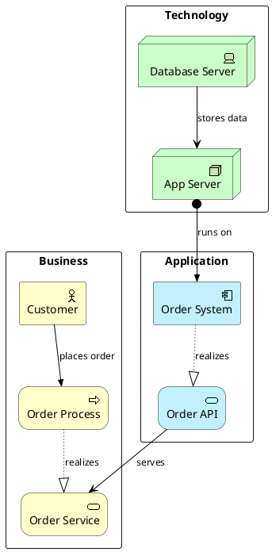

# Enterprise Architecture Diagram Generator (ArchiMate)

**Quick Start:** Add `!include <archimate/Archimate>` → Declare typed elements → Connect with `Rel_*` macros → Group into layers with `rectangle` → Wrap in ` ```plantuml ` fence.

> ⚠️ **IMPORTANT:** Always use ` ```plantuml ` or ` ```puml ` code fence. NEVER use ` ```text ` — it will NOT render as a diagram.

## Critical Rules

- Every diagram starts with `@startuml` and ends with `@enduml`
- Must include `!include <archimate/Archimate>` before using any macros
- Element syntax: `Layer_Type(alias, "Label")`
- Relationship syntax: `Rel_Type(fromAlias, toAlias, "label")`
- Use `rectangle "Layer" { ... }` to group elements into ArchiMate layers
- Directional suffixes `_Up`, `_Down`, `_Left`, `_Right` control relationship direction

## Element Macros

### Business Layer

| Macro | ArchiMate Element |
|-------|-------------------|
| `Business_Actor(id, "Label")` | Business Actor |
| `Business_Role(id, "Label")` | Business Role |
| `Business_Process(id, "Label")` | Business Process |
| `Business_Function(id, "Label")` | Business Function |
| `Business_Service(id, "Label")` | Business Service |
| `Business_Event(id, "Label")` | Business Event |
| `Business_Interface(id, "Label")` | Business Interface |
| `Business_Collaboration(id, "Label")` | Business Collaboration |
| `Business_Object(id, "Label")` | Business Object |
| `Business_Product(id, "Label")` | Business Product |
| `Business_Contract(id, "Label")` | Business Contract |
| `Business_Representation(id, "Label")` | Business Representation |

### Application Layer

| Macro | ArchiMate Element |
|-------|-------------------|
| `Application_Component(id, "Label")` | Application Component |
| `Application_Service(id, "Label")` | Application Service |
| `Application_Function(id, "Label")` | Application Function |
| `Application_Interface(id, "Label")` | Application Interface |
| `Application_Process(id, "Label")` | Application Process |
| `Application_Interaction(id, "Label")` | Application Interaction |
| `Application_Event(id, "Label")` | Application Event |
| `Application_Collaboration(id, "Label")` | Application Collaboration |
| `Application_DataObject(id, "Label")` | Application Data Object |

### Technology Layer

| Macro | ArchiMate Element |
|-------|-------------------|
| `Technology_Device(id, "Label")` | Technology Device |
| `Technology_Node(id, "Label")` | Technology Node |
| `Technology_SystemSoftware(id, "Label")` | System Software |
| `Technology_Artifact(id, "Label")` | Technology Artifact |
| `Technology_CommunicationNetwork(id, "Label")` | Communication Network |
| `Technology_Path(id, "Label")` | Technology Path |
| `Technology_Service(id, "Label")` | Technology Service |
| `Technology_Process(id, "Label")` | Technology Process |
| `Technology_Function(id, "Label")` | Technology Function |
| `Technology_Interface(id, "Label")` | Technology Interface |

### Motivation Layer

| Macro | ArchiMate Element |
|-------|-------------------|
| `Motivation_Stakeholder(id, "Label")` | Stakeholder |
| `Motivation_Driver(id, "Label")` | Driver |
| `Motivation_Assessment(id, "Label")` | Assessment |
| `Motivation_Goal(id, "Label")` | Goal |
| `Motivation_Outcome(id, "Label")` | Outcome |
| `Motivation_Principle(id, "Label")` | Principle |
| `Motivation_Requirement(id, "Label")` | Requirement |
| `Motivation_Constraint(id, "Label")` | Constraint |
| `Motivation_Value(id, "Label")` | Value |

### Strategy Layer

| Macro | ArchiMate Element |
|-------|-------------------|
| `Strategy_Capability(id, "Label")` | Capability |
| `Strategy_Resource(id, "Label")` | Resource |
| `Strategy_CourseOfAction(id, "Label")` | Course of Action |
| `Strategy_ValueStream(id, "Label")` | Value Stream |

### Implementation Layer

| Macro | ArchiMate Element |
|-------|-------------------|
| `Implementation_WorkPackage(id, "Label")` | Work Package |
| `Implementation_Deliverable(id, "Label")` | Deliverable |
| `Implementation_Plateau(id, "Label")` | Plateau |
| `Implementation_Gap(id, "Label")` | Gap |
| `Implementation_Event(id, "Label")` | Implementation Event |

## Relationship Macros

All relationships support directional suffixes: `_Up`, `_Down`, `_Left`, `_Right`.

| Macro | ArchiMate Relationship | Line Style |
|-------|------------------------|------------|
| `Rel_Composition(from, to, "label")` | Composition | Solid + filled diamond |
| `Rel_Aggregation(from, to, "label")` | Aggregation | Solid + open diamond |
| `Rel_Assignment(from, to, "label")` | Assignment | Solid + circle→triangle |
| `Rel_Realization(from, to, "label")` | Realization | Dotted + hollow triangle |
| `Rel_Serving(from, to, "label")` | Serving | Solid + arrow |
| `Rel_Triggering(from, to, "label")` | Triggering | Solid + filled triangle |
| `Rel_Flow(from, to, "label")` | Flow | Dashed + filled triangle |
| `Rel_Access(from, to, "label")` | Access | Dotted line |
| `Rel_Access_r(from, to, "label")` | Access (read) | Dotted + arrow |
| `Rel_Access_w(from, to, "label")` | Access (write) | Dotted + reverse arrow |
| `Rel_Influence(from, to, "label")` | Influence | Dashed + arrow |
| `Rel_Association(from, to, "label")` | Association | Solid line |
| `Rel_Specialization(from, to, "label")` | Specialization | Solid + hollow triangle |

## Quick Example



## Diagram Types

| Type | Purpose | Key Macros | Example |
|------|---------|------------|---------|
| Enterprise Landscape | Full B/A/T layered view | All layers | [enterprise-landscape.md](examples/enterprise-landscape.md) |
| Application Integration | App-to-app data flows | `Application_*` | [application-integration.md](examples/application-integration.md) |
| Technology Infrastructure | Infrastructure stack | `Technology_*` | [technology-infrastructure.md](examples/technology-infrastructure.md) |
| Business Capability | Capability map | `Strategy_*`, `Business_*` | [business-capability.md](examples/business-capability.md) |
| Migration Planning | Plateau-based roadmap | `Implementation_*` | [migration-planning.md](examples/migration-planning.md) |
| Security Architecture | Security controls | `Technology_*`, `Motivation_*` | [security-architecture.md](examples/security-architecture.md) |
| Data Architecture | Data flow & ownership | `Application_DataObject`, `Rel_Access_*` | [data-architecture.md](examples/data-architecture.md) |
| DevOps Pipeline | CI/CD delivery chain | `Technology_*`, `Application_*` | [devops-pipeline.md](examples/devops-pipeline.md) |
