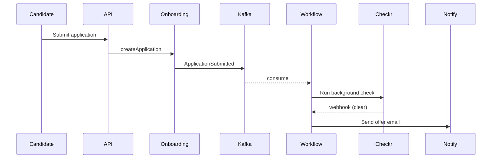

# Marp Slide Deck Generator

**Quick Start:** Add YAML front-matter `marp: true` → write Markdown with `---` between slides → run `marp deck.md --pptx` → done.

```markdown
---
marp: true
theme: default
paginate: true
---

# Title Slide

Speaker · Date

---

# Section Slide

- Point 1
- Point 2
```

## Why Marp

| Property | Value |
|---|---|
| Format | Standard Markdown + YAML front-matter |
| Slide separator | `---` (Markdown horizontal rule) |
| Themes | Built-in (`default`, `gaia`, `uncover`) + custom CSS |
| Diagram support | Mermaid (built-in), embedded HTML, images |
| Export targets | `.pptx`, `.pdf`, `.html`, `.png` per slide |
| Toolchain | `npx @marp-team/marp-cli` — single binary |
| Editor preview | VS Code "Marp for VS Code" extension, live |

## How this skill ties into the rest of the repo

Marp is the **glue** that takes diagram outputs from the other skills and assembles them into a deliverable deck:

| Diagram source | How it lands in a Marp slide |
|---|---|
| [mermaid](../mermaid/SKILL.md) | Native — paste the ` ```mermaid ` block directly |
| [architecture](../architecture/SKILL.md) | Paste the HTML block directly (Marp passes HTML through) |
| [infocard](../infocard/SKILL.md) / [infographic](../infographic/SKILL.md) | Paste HTML block directly |
| [drawio](../drawio/SKILL.md) | Export `.drawio` to SVG via `drawio --export --format svg`, embed as `` |
| [c4](../c4/SKILL.md) / [uml](../uml/SKILL.md) / [bpmn](../bpmn/SKILL.md) / [archimate](../archimate/SKILL.md) / [cloud](../cloud/SKILL.md) | Render PlantUML to PNG (`plantuml -tpng -dpi 200`), embed as `` |
| [graphviz](../graphviz/SKILL.md) | Render to SVG/PNG (`dot -Tsvg`), embed as `` |
| [vega](../vega/SKILL.md) | `vega-lite -s 2 chart.vl.json chart.png`, embed as `` |

**Key insight:** the existing skills produce diagrams in their native formats; Marp doesn't replace them. It composes them into a deck.

## Critical Rules

### Rule 1: YAML front-matter is required
The first lines of the file must be:

```yaml
---
marp: true
---
```

Without `marp: true`, the file is treated as plain Markdown. Other useful front-matter keys:

```yaml
---
marp: true
theme: default            # default | gaia | uncover | <custom name>
size: 16:9                # 16:9 | 4:3 | A4 | <width>x<height>px
paginate: true            # show slide numbers
header: 'Project Apollo'  # appears on every slide
footer: 'Confidential'
backgroundColor: '#fff'
class: lead               # apply 'lead' class to all slides
---
```

### Rule 2: Slides separated by `---`
A bare `---` on its own line ends one slide and starts the next. Do **not** put `---` at the end of the file.

```markdown
---
marp: true
---

# Slide 1

content

---

# Slide 2
```

### Rule 3: Per-slide directives use HTML comments
Override front-matter on a single slide with a special comment:

```markdown
<!-- _class: lead -->
<!-- _backgroundColor: #1e293b -->
<!-- _color: white -->

# Cover Slide
```

Underscore prefix = "this slide only". No underscore = "this slide and all that follow until overridden".

### Rule 4: Mermaid needs a flag
Mermaid blocks render only when you pass `--html` and use the math/mermaid plugin, or use a Marp theme with Mermaid baked in. The shortest working invocation:

```bash
npx @marp-team/marp-cli@latest deck.md --pptx --html
```

For complex Mermaid features (C4, sequence with autoNumber, etc.), pre-render to SVG via the [mermaid](../mermaid/SKILL.md) skill's CLI and embed the SVG instead. This also makes the deck reproducible without internet.

### Rule 5: Image sizing via Marp's image syntax
Marp extends Markdown image syntax with sizing/positioning hints:

```markdown
        # width 600px
             # height 400px
                  # full-slide background
 # right 40% of slide
               # fit, preserve aspect
```

`bg` is the killer feature — it makes a single image fill the slide background, perfect for hero diagrams.

### Rule 6: Two-column layouts via HTML or columns plugin
Markdown alone doesn't do columns. Three options:

```markdown
<div class="columns">
<div>

## Left

- bullet
- bullet

</div>
<div>

## Right


</div>
</div>

<style>
.columns { display: grid; grid-template-columns: 1fr 1fr; gap: 1rem; }
</style>
```

For repeated use, put the `<style>` block in front-matter `style:` or a custom theme.

### Rule 7: Speaker notes via HTML comment
```markdown
# Slide

content

<!--
Speaker notes go here. They show in PowerPoint's notes pane after .pptx export.
-->
```

## Common slide patterns for architecture decks

```markdown
---
marp: true
theme: default
paginate: true
size: 16:9
header: 'Architecture Review · 2026 Q2'
---

<!-- _class: lead -->
<!-- _backgroundColor: #0f172a -->
<!-- _color: white -->

# HR Onboarding Platform
## Architecture Review

Sheker · April 2026

---

# Agenda

1. Context
2. Container architecture
3. Data flow
4. Open questions

---

# System Context


- 3 internal users: candidate, recruiter, manager
- 4 external SaaS dependencies
- One enterprise boundary: Acme

---

# Container Architecture


<!-- Speaker notes:
Walk through API Gateway -> Onboarding Service -> Postgres path.
Note Temporal as the orchestrator for long-running workflows.
-->

---

# Onboarding Sequence



---

<!-- _class: lead -->

# Open Questions

- Should onboarding state live in Temporal or Postgres?
- Move Checkr integration behind feature flag?
```

## Examples

| File | Demonstrates |
|---|---|
| [examples/architecture-review.md](examples/architecture-review.md) | Full deck pulling diagrams from mermaid + c4 + architecture skills |

## Export commands

```bash
# PowerPoint (.pptx) — primary use case
npx @marp-team/marp-cli@latest deck.md --pptx --html

# PDF — for distribution where PowerPoint isn't installed
npx @marp-team/marp-cli@latest deck.md --pdf --html

# Editable .pptx (slides are vector, not images)
npx @marp-team/marp-cli@latest deck.md --pptx --html --pptx-editable

# Per-slide PNGs (for embedding in other tools)
npx @marp-team/marp-cli@latest deck.md --images png

# Watch mode for live editing
npx @marp-team/marp-cli@latest deck.md -w --pptx --html
```

`--pptx-editable` is important: without it, each slide is rasterized to an image inside the .pptx, which means stakeholders can't tweak text in PowerPoint. With it, text and shapes stay editable. **It requires `libreoffice` on the PATH** — install with `apt install libreoffice` (Linux) or `brew install --cask libreoffice` (mac). Without LibreOffice, fall back to plain `--pptx` (rasterized, but works everywhere).

## Best Practices

1. **Pre-render diagrams to SVG/PNG.** Inline Mermaid is convenient but breaks if your reviewer opens the deck offline or in a Marp version mismatch. Pre-rendered SVGs are bulletproof.
2. **Use `_class: lead`** for cover and section slides — built-in Marp themes give them centered, larger typography automatically.
3. **One idea per slide.** A C4 Container diagram on one slide, with the implications/tradeoffs on the next slide as bullets. Don't crowd.
4. **Speaker notes via HTML comments** survive `.pptx` export and show up in PowerPoint's notes pane.
5. **Custom theme for company branding.** A 50-line CSS file (`company.css`) → `--theme-set company.css` → consistent fonts and colors across every deck.
6. **Pin the Marp version.** `npx @marp-team/marp-cli@4.0.4` rather than `@latest` for repeatable rendering in CI.
7. **Generate decks in CI.** Architecture review every sprint? Commit the `.md`, render the `.pptx` in CI, attach to the calendar invite. Far better than manually maintaining a PowerPoint file.
