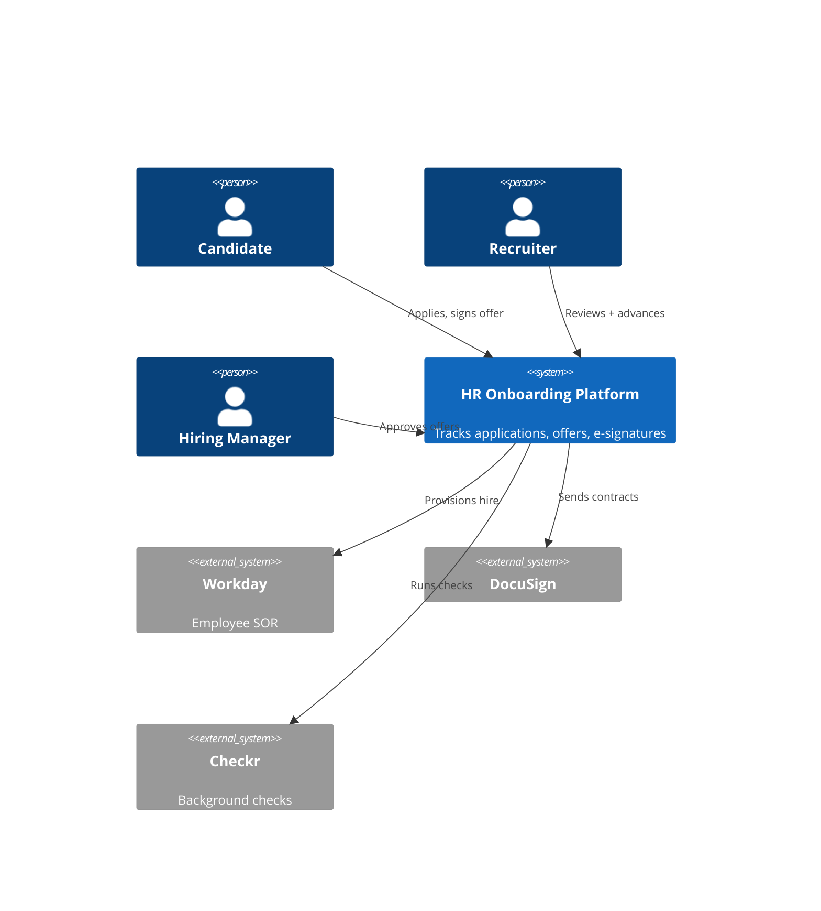
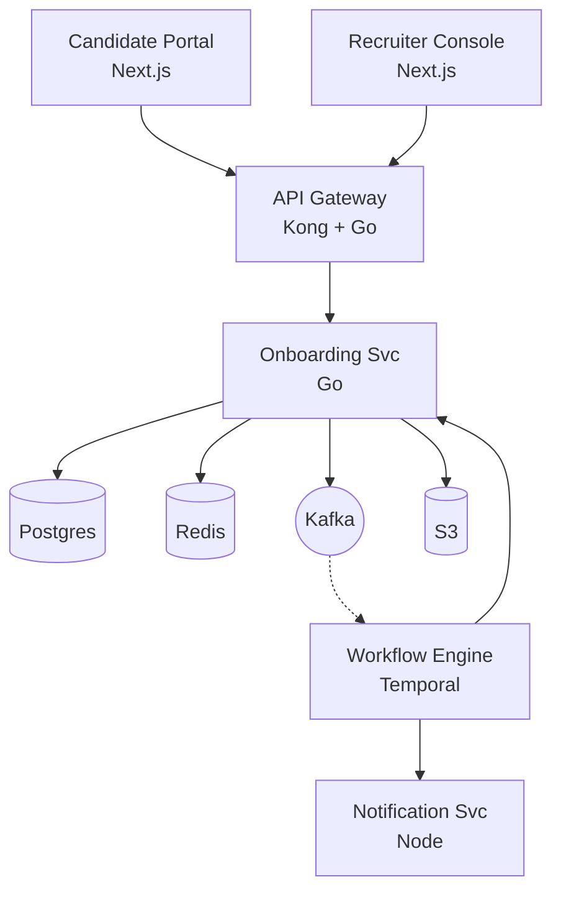
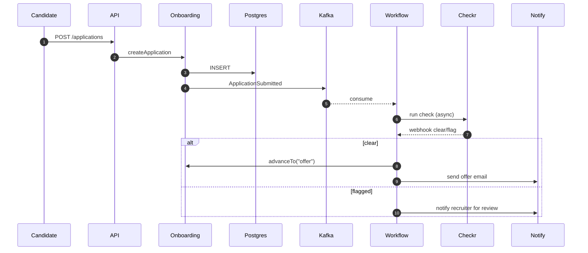

<!-- _class: lead -->
<!-- _backgroundColor: #0f172a -->
<!-- _color: white -->

# HR Onboarding Platform
## Architecture Review — Q2 2026

Sheker · April 2026

---

# Agenda

1. **Context** — who uses the system, what it talks to
2. **Containers** — services, data stores, technology choices
3. **One critical sequence** — onboarding workflow end-to-end
4. **Open questions** — the two decisions we need this meeting to resolve

<!--
Speaker note: 25 min total. 5 / 10 / 5 / 5. Hold questions to the end of each section.
-->

---

# Context Level 1

---

# Containers Level 2

**Stack choices**

- **Go** for state-machine services — operational simplicity
- **Temporal** for long-running workflows — durability over hand-rolled retries
- **Kafka** as the inter-service bus — replay capability for audit
- **Postgres** as system of record — Temporal's history is *not* a SOR

**Out of scope today:** mobile clients, ML resume screening (separate review)

---

# Sequence: Application → Offer

<!--
The async fan-out is the architecturally interesting bit. Walk through
why we put Workflow on the consume side rather than calling Checkr from
Onboarding directly: durability, retry semantics, separation of state.
-->

---

# Open Questions

## 1. State of record

**Should the onboarding state machine live in Temporal or Postgres?**

- Today: Postgres is canonical, Temporal mirrors
- Pro mirror: clear ownership, audit clarity
- Con: dual writes, drift risk
- **Ask:** keep dual or move to Temporal-as-SOR?

## 2. Checkr feature flag

**Wrap Checkr behind a per-tenant flag?**

- Today: every tenant gets background checks
- Some enterprises want their own provider (HireRight)
- **Ask:** invest in the abstraction now or wait for the second tenant?

---

<!-- _class: lead -->
<!-- _backgroundColor: #f1f5f9 -->

# Decisions needed today

1. **State of record** — keep dual, or move to Temporal?
2. **Checkr flag** — abstract now, or wait?

Thank you.
