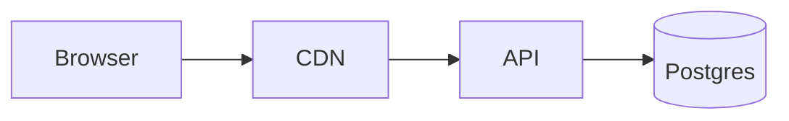

# Mermaid Diagram Generator

**Quick Start:** Wrap diagram source in a ` ```mermaid ` fenced code block. No HTML, no external scripts — the renderer handles it.



## Why Mermaid

| Property | Value |
|---|---|
| Format | Plain text inside ` ```mermaid ` fence |
| Renders in | GitHub (native since 2022), GitLab, Bitbucket, VS Code, Notion, Obsidian, Confluence (plugin), Hugo, Docusaurus, MkDocs |
| Diagram types | 18+ (see table below) |
| Toolchain | Browser-only — no install needed for viewing; `@mermaid-js/mermaid-cli` for static export |
| Cost | Zero runtime if your viewer supports it; ~1 MB JS if you self-host |

This is the diagram format with the widest renderer support today. Default to Mermaid unless you specifically need draw.io's shape libraries, PlantUML's stdlibs, or Vega's data binding.

## When to use this skill vs. others

| If you need… | Use |
|---|---|
| Quick diagram inside a README, PR description, or wiki | **mermaid** (this skill) |
| Rich shape libraries (Cisco, AWS service icons, BPMN) | [drawio](../drawio/SKILL.md) |
| Strict C4 modeling notation with PlantUML stdlib | [c4](../c4/SKILL.md) — though Mermaid has `C4Context` blocks too |
| Visual layered architecture with semantic colors | [architecture](../architecture/SKILL.md) |
| Charts driven by data | [vega](../vega/SKILL.md) |

## Critical Rules

### Rule 1: Fenced block only
Always use ` ```mermaid ` exactly — not ` ```Mermaid `, not ` ```mmd `. Renderers are case-sensitive.

### Rule 2: First line declares diagram type
The first non-empty line **must** be the type keyword. Mermaid won't auto-detect.

```
flowchart LR        ← required
sequenceDiagram     ← required
classDiagram        ← required
erDiagram           ← required
stateDiagram-v2     ← required (note: -v2 is the modern syntax)
gantt               ← required
mindmap             ← required
C4Context           ← required
```

### Rule 3: Direction matters for flowcharts
`flowchart LR` (left-right), `TB` / `TD` (top-bottom), `RL`, `BT`. Pick based on reading flow — pipelines = LR, hierarchies = TB.

### Rule 4: IDs vs. labels
Node `id` is what edges reference; the bracketed text is the label.

```
flowchart LR
  api[API Gateway]
  db[(Postgres)]
  api --> db
```

`api` and `db` are IDs (no spaces). Labels can have spaces and Markdown.

### Rule 5: Shape syntax encodes meaning
| Syntax | Shape | Use for |
|---|---|---|
| `id[Text]` | Rectangle | Default / process |
| `id(Text)` | Rounded rectangle | Soft step |
| `id([Text])` | Stadium | Start/end |
| `id[[Text]]` | Subroutine | Internal call |
| `id[(Text)]` | Cylinder | Database |
| `id((Text))` | Circle | State / event |
| `id{Text}` | Diamond | Decision |
| `id{{Text}}` | Hexagon | Preparation |
| `id[/Text/]` | Parallelogram | Input/output |

### Rule 6: Edge styles signal flow type
| Syntax | Meaning |
|---|---|
| `A --> B` | Solid arrow |
| `A --- B` | Solid line, no arrow |
| `A -.-> B` | Dashed arrow (async / optional) |
| `A ==> B` | Thick arrow (critical path) |
| `A -->|"label"| B` | Labeled edge |
| `A -- text --> B` | Alternative label syntax |

### Rule 7: Use subgraphs for grouping
```
flowchart LR
  subgraph aws[AWS us-east-1]
    api --> db
  end
  user --> aws
```

## Diagram type cheatsheet

| Type | Keyword | Best for |
|---|---|---|
| Flowchart | `flowchart LR` | Generic graphs, system topology, decision trees |
| Sequence | `sequenceDiagram` | API call traces, user interactions over time |
| Class | `classDiagram` | OO design, type hierarchies |
| State | `stateDiagram-v2` | State machines, workflows |
| ER | `erDiagram` | Database schemas |
| Gantt | `gantt` | Project timelines |
| Mindmap | `mindmap` | Brainstorms, taxonomies |
| Pie | `pie title` | Simple proportions |
| Journey | `journey` | User journey maps with sentiment |
| GitGraph | `gitGraph` | Branch/merge visualization |
| C4 | `C4Context` / `C4Container` | Software architecture, lightweight |
| Quadrant | `quadrantChart` | 2x2 strategy plots |
| Sankey | `sankey-beta` | Flow volumes |
| Timeline | `timeline` | Historical / event timelines |
| Block | `block-beta` | Layered block diagrams |
| Architecture | `architecture-beta` | Cloud architecture (cluster + service) |
| Requirement | `requirementDiagram` | RM / safety-critical specs |

## Examples

| File | Type | Demonstrates |
|---|---|---|
| [examples/flowchart.md](examples/flowchart.md) | flowchart | Subgraphs, shape variety, edge labels |
| [examples/sequence.md](examples/sequence.md) | sequenceDiagram | Activations, alt/loop blocks, notes |
| [examples/erd.md](examples/erd.md) | erDiagram | Entities, cardinality, attributes |
| [examples/c4-context.md](examples/c4-context.md) | C4Context | Mermaid's lightweight C4 alternative |

## Static export

For PDF / slide / static-site embedding when the renderer doesn't speak Mermaid:

```bash
npx -p @mermaid-js/mermaid-cli mmdc -i diagram.mmd -o diagram.svg
npx -p @mermaid-js/mermaid-cli mmdc -i diagram.mmd -o diagram.png -w 1600
```

`-t dark` for dark theme, `-c config.json` for custom theming.

## Best Practices

1. **Keep node IDs short.** `api`, `db`, `lb` — not `apiGatewayService`. Labels carry the description.
2. **Direction matches reading flow.** Pipelines and request flows: `LR`. Trees and inheritance: `TB`.
3. **Use `%%{init: {...}}%%`** at the top to override theme/font globally for that diagram only:
   ```
   %%{init: {'theme':'neutral', 'flowchart': {'curve':'basis'}}}%%
   flowchart LR
   ```
4. **Don't fight the layout engine.** Mermaid auto-routes — if it looks wrong, the structure is wrong, not the layout. Restructure with subgraphs before adding `linkStyle`.
5. **One concept per diagram.** Don't try to show users + infra + data flow + auth in one flowchart. Split.
6. **Comment with `%%`** — useful for marking sections in long sequence diagrams.
7. **GitHub renders Mermaid 4.x.** New diagram types like `architecture-beta` may not work everywhere — check renderer support before relying on them in shared docs.
