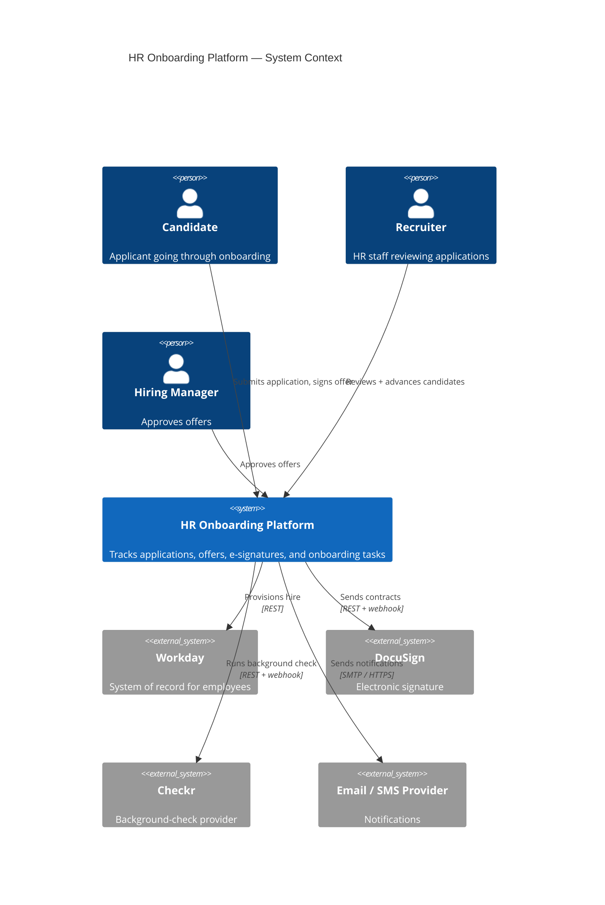

# Mermaid Example — C4 Context Diagram

Mermaid's lightweight C4 implementation. Useful when you want C4 notation without pulling in PlantUML. For richer C4 (icons, styling, sprites, all four levels), use the [c4](../../c4/SKILL.md) skill.

## Source

````markdown

````

## Rendered


## C4 element types in Mermaid

| Element | Function | Use for |
|---|---|---|
| `Person(id, "name", "desc")` | User / actor | Humans interacting with the system |
| `System(id, "name", "desc")` | Your system | The thing you're describing |
| `System_Ext(id, ...)` | External system | Third-party / out-of-scope systems |
| `Container(id, ...)` | Container | App, service, database (in `C4Container` block) |
| `ContainerDb(id, ...)` | Database container | Storage tier |
| `Component(id, ...)` | Component | Module within a container (in `C4Component`) |
| `Boundary(id, "label")` | Grouping box | Org, team, or trust boundary |
| `Rel(from, to, "label", "tech")` | Relationship | Connection with optional tech |

Switch the first line to `C4Container` or `C4Component` for the deeper levels — same syntax, different element vocabulary.

## Mermaid C4 vs. PlantUML C4

| | Mermaid C4 | PlantUML C4 ([c4](../../c4/SKILL.md) skill) |
|---|---|---|
| Renders in GitHub natively | Yes | No (needs a PlantUML server) |
| Visual polish | Adequate | Higher — sprites, icons, gradients |
| Layout control | Limited (`UpdateLayoutConfig`) | Full (`Lay_R`, `Lay_D`, `together`) |
| Stable | Beta — syntax has changed across versions | Mature |
| Use for | READMEs, PRs, lightweight docs | Architecture review docs, presentations |
