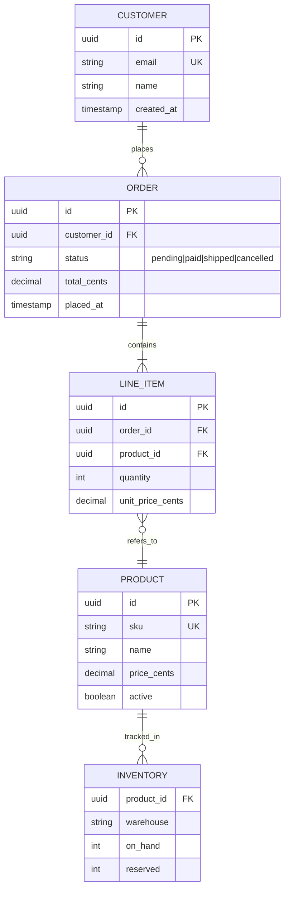

# Mermaid Example — Entity-Relationship Diagram

E-commerce schema with customers, orders, line items, and products. Shows cardinality notation, attribute types, primary/foreign keys, and notes.

## Source

````markdown

````

## Rendered


## Cardinality notation

Both ends of every relationship line carry a marker:

| Left side | Right side | Meaning |
|---|---|---|
| `\|\|` | `\|\|` | Exactly one — one |
| `\|\|` | `o{` | Exactly one — zero or many |
| `\|\|` | `\|{` | Exactly one — one or many |
| `}o` | `o\|` | Zero or many — zero or one |
| `}\|` | `\|{` | One or many — one or many |

Read it like English: `CUSTOMER ||--o{ ORDER : places` = "one customer places zero or many orders".

## Attribute keys

| Marker | Meaning |
|---|---|
| `PK` | Primary key |
| `FK` | Foreign key |
| `UK` | Unique key |
| `"text"` | Inline comment / enum hint |

ER diagrams in Mermaid are layout-only — they don't validate referential integrity. For schema-as-code with constraints, prefer DBML or actual migration files; use Mermaid for documentation/communication.
