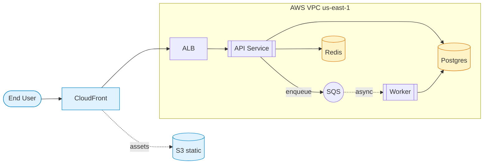

# Mermaid Example — Flowchart

Demonstrates subgraphs, mixed shapes, edge labels, dashed (async) edges, and styling.

## Source

````markdown

````

## Rendered



## Notes

- `subgraph aws[...]` groups the VPC contents in a labeled box.
- `direction TB` inside a subgraph overrides the parent's `LR`.
- `-.->` marks async/CDN-asset paths visually distinct from the request path.
- `classDef` + `class` apply consistent styling to multiple nodes — better than per-node `style`.
- Stadium shape `([...])` for actors, cylinder `[(...)]` for storage, double-square `[[...]]` for services. Reading the diagram, shape alone tells you what each node is.
