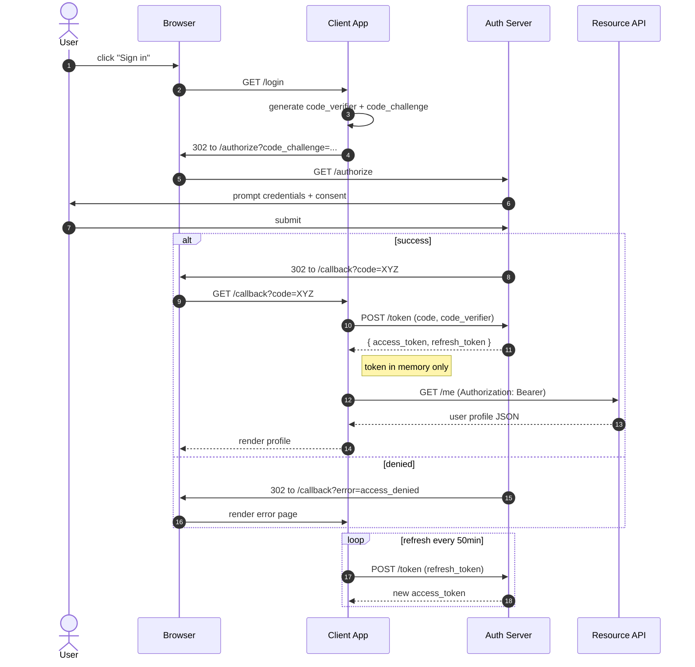

# Mermaid Example — Sequence Diagram

OAuth 2.0 authorization-code flow with PKCE. Shows participants, activations, alt/opt blocks, notes, and async returns.

## Source

````markdown

````

## Rendered


## Syntax cheat sheet

| Symbol | Meaning |
|---|---|
| `->>` | Solid arrow — synchronous request |
| `-->>` | Dashed arrow — return / response |
| `-x` | Lost / failed message |
| `actor X as Name` | Stick-figure participant |
| `participant X as Name` | Box participant |
| `Note right of X: text` | Annotation; also `left of`, `over X,Y` |
| `alt / else / end` | Conditional branches |
| `opt / end` | Optional branch (single, no else) |
| `loop label / end` | Repeated section |
| `par / and / end` | Parallel sections |
| `autonumber` | Auto-number every message |
| `activate X` / `deactivate X` | Manual lifeline activation (auto on by default) |
